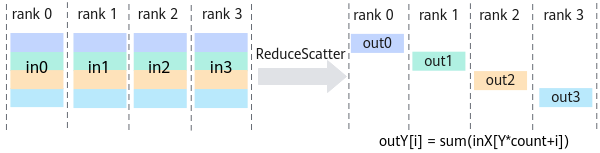
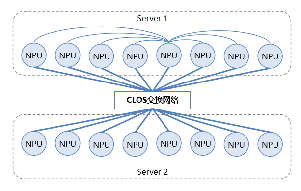

# **粤港澳赛区（ReduceScatter）- 初赛** 
## **一、赛题描述**
实现集合通信算子ReduceScatter的操作接口，将通信域内所有rank的输入数据均分成rank size份，然后分别取每个rank的rank size之一份数据进行归约操作（如sum）。最后，将结果按照编号分散到各个rank的输出buffer。其计算原理如下图所示。



评测环境为2*8卡昇腾Ascend 950的仿真环境，拓扑如下所示，横向为Mesh互联，纵向为Clos组网。

拓扑由2个Server组成，每个Server内包含8个NPU。
Server内8个NPU之间为Full-Mesh互联，Server间通过Clos网络互通。
每个NPU连接Clos网络的带宽大致是Server内单条直连链路带宽的8倍。



**二、核心定义与约束**
**2.1 函数原型与参数说明**
HcclResult HcclReduceScatter(void *sendBuf, void *recvBuf, uint64_t recvCount, HcclDataType dataType, HcclReduceOp op, HcclComm comm, aclrtStream stream)

**参数名**	**输入/输出**	**描述**
sendBuf	输入	源数据buffer地址。
recvBuf	输出	目的数据buffer地址，集合通信结果输出至此buffer中。
recvCount	输入	参与ReduceScatter操作的recvBuf的数据size，sendBuf的数据size则等于recvCount * rank size。
dataType	输入	ReduceScatter操作的数据类型，HcclDataType类型。
op	输入	Reduce的操作类型，如sum、prod、max、min。
comm	输入	集合通信操作所在的通信域。
stream	输入	本rank所使用的stream。
接口成功返回HCCL_SUCCESS，其他失败。

**2.2 算子约束**
所有rank的recvCount、dataType、op均相同。
针对一个对端仅能申请1个channel进行通信。基于赛题提供的拓扑，每两个npu之间仅有一条物理链路，因此与同一个对端只使用一条channel完成通信的收/发、同步等操作即可，使用多个channel不会带来额外的性能收益。
**2.3 规则要求**
限定使用AICPU+TS通信引擎

算子实现需满足确定性要求，即在相同输入下（特别是浮点数输入），多次通信计算得到的输出结果相同

**三、评分指标**
赛题将从以下三个维度进行评分：

功能分：通过功能测试用例验证，通过得分，不通过得0分。
性能分：通过性能测试用例验证，不通过得0分，通过则按照带宽用量计分，带宽最高得满分，按照排名依次递减。
如不满足2.3中的规则要求，则不得分。

数据类型覆盖float32，（输出）数据size覆盖4B、512KB、512MB、400MB+4B，Reduce类型为sum。

**3.1 用例说明**
功能用例：

共4个功能用例（数据量分别为4B、512KB、512MB、400M+4B），每个用例15分，共60分。
代码提交后，等待实时判分。
性能用例：

共3个功能用例（数据量分别为512KB、512MB、400M+4B），每个用例10分，共30分。
每天统一出1次性能分，取第二天凌晨3点前最后1次提交的代码进行性能评分。
需保证功能用例全部通过才能参与性能评分。

## 编译方法

```shell
bash build.sh
```
完整的Ascend 环境安装在路径: `/home/workspace`
包括：Ascend、hccl、hcomm

## ReduceScatter算子	
基于给定拓扑，实现集合通信ReduceScatter算子功能，主要包括控制面的资源申请和数据面的算法逻辑实现。	

1. 选手仅允许修改 `custom.h`、`reduce_scatter.cc`、`exec_op.cc` 共 3 个文件内容。
2. 限定使用AICPU+TS模式
3. 算子实现需满足确定性要求，即在相同输入下（特别是浮点数输入），多次通信计算得到的输出结果相同。

## 用例
```shell
  source /home/workspace/Ascend/cann-9.1.0/set_env.sh
  source /home/workspace/hcomm/test/hccl_vm/hccl_vm_install/script/hccl_config.sh   # 设 RANK_TABLE_FILE 等运行变量
  cd /home/workspace/hcomm/test/hccl_vm/hccl_vm_install/bin && ./hccl-vm start ascend950_cluster_32_server_normal.yaml
    (hvm)$> hccl-vm mock-comm 112
    (hvm)$> mpirun --allow-run-as-root --oversubscribe -np 2 /home/workspace/Ascend/cann-9.1.0/tools/hccl_test/bin/alltoall_test -b 64 -e 64 -d int32 -o sum -w 0 -n 1 -c 1
    (hvm)$> hccl-vm plugin run @checker
    (hvm)$> exit
  更多集群配置与用例见 /home/workspace/hcomm/test/hccl_vm/README-Competition.md §4
```

