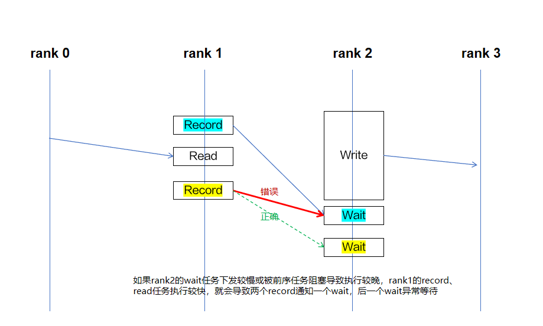

# ReduceScatter 集合通信算子

## 1. 项目介绍

```
├── CMakeLists.txt                  # 顶层 CMake 配置
├── build.sh                        # 构建脚本
├── .clang-format                   # 代码风格配置
├── include/                        # 头文件目录
│   ├── hccl.h                      # 集合通信算子头文件
│   ├── common.h                    # 通用数据结构定义
│   ├── custom.h                    # ★ 选手编写：自定义数据结构定义
│   ├── log.h                       # 日志宏定义
│   └── binary_stream.h             # 序列化类定义
├── op_host/                        # Host侧代码目录
│   ├── reduce_scatter.cc           # ★ 选手编写：Host侧资源申请逻辑
│   └── launch_aicpu_kernel.cc      # AICPU Kernel加载与下发逻辑
└── op_kernel_aicpu/                # Device侧代码目录
    ├── aicpu_kernel.cc             # AICPU Kernel函数实现
    └── exec_op.cc                  # ★ 选手编写：通信算法编排逻辑
```

> [!NOTE] 注意：
> 算子工程中已提前预制好固有逻辑，选手仅允许修改 `custom.h`、`reduce_scatter.cc`、`exec_op.cc` 共 3 个文件内容。

## 2. 编译运行

### 2.1 安装 CANN-Toolkit 包

请单击[下载链接](https://ascend.devcloud.huaweicloud.com/artifactory/cann-run-mirror/software/legacy/20260701000328953/)，根据产品型号和环境架构下载对应软件包。安装命令如下，更多指导参考《[CANN软件安装指南](https://www.hiascend.com/document/redirect/CannCommunityInstWizard)》。

```bash
# 确保安装包具有可执行权限
chmod +x Ascend-cann-toolkit_9.1.0_linux-${arch}.run
# 安装命令
./Ascend-cann-toolkit_9.1.0_linux-${arch}.run --full --install-path=${install_path}
```

### 2.2 环境变量配置

按需选择合适的命令使环境变量生效。

```bash
# 默认路径安装，以root用户为例（非root用户，将/usr/local替换为${HOME}）
source /usr/local/Ascend/cann/set_env.sh
# 指定路径安装
# source ${install_path}/cann/set_env.sh
```

### 2.3 编译算子工程

```bash
bash build.sh

# 编译 Debug 版本，便于断点调试
bash build.sh --debug
```

## 3. 代码格式

选手代码需符合 [.clang-format](.clang-format) 文件中的代码风格规范，可通过下列命令一键修改：

```bash
bash build.sh --format
```


### expend infomation 
信息同步：
1）对于ReduceScatter算子，用例的数据量指的是输入内存的大小。
2）特殊情况：针对ReduceScatter算子4B的功能用例，为了确保每张卡的输出内存至少有1个float32的数据，会把每张卡的输入内存的大小扩展到4B*rankSize（也就是64B）。
3）对于512KB及以上的数据量，输入内存不会再乘以rankSize

### 已知要点

- 赛题为2层拓扑，允许使用layer-0和layer-1的链路，通过HcclRankGraphGetLayers接口可查出当前通信域的netLayers，包含0和1两层。可根据算法需要,选择对应层级的链路。
- 考虑小数据量场景任务数量对性能的影响，小数据量下，通信任务执行时间短，通信任务数量过多，会导致任务下发的时延较大，影响最终性能。

- 比赛经验tip:
1. notify的多打一问题：hccl-vm@checker插件当前还无法校验拦截notify的多打一问题（对于同一个notify资源的多组record和wait任务，需要保证时序，避免多个record通知同一个wait，导致另一个wait任务等待超时），会导致性能出分异常。建议同学们自查下算法逻辑；补充说明：Record任务本质上是往对应的notify寄存器上写1，Wait任务是确认notify寄存器是否被写1，写1了就可以继续执行后续任务同时将对应notify寄存器重置为0，两次Record都提前向同一个寄存器写了1，只有第一个Wait能正常完成并将寄存器重置为0，第二个Wait会一直等待（因为没有新的record再将该寄存器写1了）


2. 一个对端申请多个channel
有个约束限制需要跟大家同步一下：针对一个对端仅能申请1个channel进行通信。请大家自查下算法逻辑，避免一个对端申请多个channel导致性能出分异常。基于赛题提供的拓扑，每两个npu之间仅有一条物理链路，因此与同一个对端只使用一条channel完成通信的收/发、同步等操作即可，使用多个channel不会带来额外的性能收益。

3. CCU模式，要同时使用layer-0和layer-1的链路时，需要将不同层的通信任务放到不同的CCU Kernel
一个Ascend 950 NPU包含2个IO Die，不同IO Die包含不同的网络设备。
在赛题给定的拓扑形态下，layer-0的网络设备和layer-1的网络设备分别分布在2个不同的IO Die上。
每个IO Die都有一个CCU，一个CCU不能跨Die使用另一个IO Die的网络设备进行通信。
在开发运行于某个CCU上的程序(ccu kernel)时，需要保证当一个ccu kernel使用的网络设备都在同一个IO Die上，CCU翻译器会自动根据它使用的网络设备推导出翻译后的指令序列应该部署到哪个CCU设备上。

4. AICPU模式下，部分数据面接口存在功能问题，暂无法使用
如下接口无法使用：
HcommWriteWithNotifyOnThread
HcommWriteReduceWithNotifyOnThread